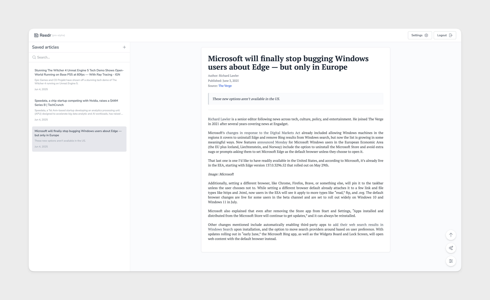

# Reedr (pre-alpha)

A clean, distraction-free article reading application that lets you save and read articles from the web with a beautiful, customizable reading experience.

## Features

- **Clean Reading Experience**: Distraction-free interface for comfortable reading
- **Article Parsing**: Save articles from any website using Mozilla's Readability engine
- **User Accounts**: Secure authentication system to access your article library
- **Customizable Settings**: Adjust font size, font family, line height, and text alignment
- **Image & Video Control**: Toggle visibility of images and videos within articles

## Tech Stack

- **Foundation**: [Create T3 App](https://create.t3.gg/) - The best way to start a full-stack, typesafe Next.js app
- **Framework**: [Next.js 15](https://nextjs.org/) - React framework with App Router
- **Language**: [TypeScript](https://www.typescriptlang.org/) - Type-safe JavaScript
- **Database**: SQLite with [Prisma ORM](https://www.prisma.io/)
- **Authentication**: Custom JWT-based auth with [jose](https://github.com/panva/jose)
- **Styling**: [Tailwind CSS](https://tailwindcss.com/) - Utility-first CSS framework
- **API**: [tRPC](https://trpc.io/) - End-to-end typesafe APIs
- **Content Parsing**: [Mozilla Readability](https://github.com/mozilla/readability) - Article extraction
- **DOM Sanitization**: [DOMPurify](https://github.com/cure53/DOMPurify) - XSS protection
- **State Management**: React Context and Hooks
- **UI Components**: Custom components with [Heroicons](https://heroicons.com/)
- **Fonts**: Google Fonts (Nunito, PT Serif, PT Sans)

## How It Works

1. **User Authentication**: The app uses JWT tokens stored in HTTP-only cookies for secure authentication.
2. **Article Parsing**: When a user adds a new article URL, the server fetches the content, processes it with Mozilla's Readability, and sanitizes HTML with DOMPurify.
3. **Data Storage**: Articles are stored in a SQLite database through Prisma ORM, associated with the user's account.
4. **User Settings**: Reading preferences (font size, family, etc.) are persisted to both localStorage and the server.
5. **Rendering**: The content is rendered with custom React components that prioritize readability and accessibility.

## Roadmap

- **Dark Theme**: Implementation of dark mode for comfortable nighttime reading
- **Mobile Version**: Responsive design optimized for mobile devices
- **Video Display**: Enhanced support for video content within articles
- **Chrome Extension**: Browser extension for easy article saving
- **Article Organization**: Improved management and sorting of saved articles
- **Tags**: Support for tagging articles for better categorization
- **Folders**: Ability to organize articles into custom folders
- **Highlights**: Feature to highlight and save important parts of articles
- **Reading Progress**: Automatic bookmarking to continue reading from where you left off

## Contributing

Contributions are welcome! Please feel free to submit a Pull Request.

1. Fork the repository
2. Create your feature branch (`git checkout -b feature/amazing-feature`)
3. Commit your changes (`git commit -m 'Add some amazing feature'`)
4. Push to the branch (`git push origin feature/amazing-feature`)
5. Open a Pull Request

## License

This project is licensed under the Business Source License 1.1 (BUSL-1.1)

## Acknowledgments

- [Mozilla Readability](https://github.com/mozilla/readability) for the article parsing technology
- [Next.js](https://nextjs.org/) for the React framework
- [Tailwind CSS](https://tailwindcss.com/) for styling
- [Prisma](https://www.prisma.io/) for database access
- [tRPC](https://trpc.io/) for type-safe APIs

